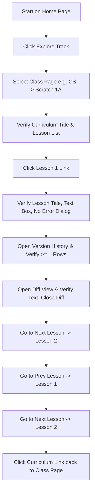

# Release Test Plan

This document details the manual and automated regression test suite to verify all core features of the gbSTEM Curriculum website before any production release. It is structured sequentially to facilitate direct translation into Cypress E2E tests.

If you want to watch Cypress execute this in your browser, you can start it with extra arguments like the following, where `--headed` makes it so it runs a visible browser and `--browser` selects a browser to run (this example is using Chromium, the open source version of Chrome that is often installed on Linux systems but you can also use `chrome` to run the official version of Google Chrome, or `firefox` to run Firefox). But as you'll see, it goes **very** fast and is hard to keep up with. You can use other arguments to have it add a video that you can playback at a slower speed. For example, `yarn run cypress --browser=chromium --headed --video` will create a video of the test run in the `cypress/videos` directory. There are many [options you can use](https://docs.cypress.io/guides/references/command-line#cypress-open). See [this page](https://docs.cypress.io/guides/getting-started/opening-the-app) to get started with Cypress.

`yarn run cypress --browser=chromium --headed`

However, remember that you can actually see what is happening on the screen in a way that Cypress isn't: it just keys off of HTML elements and CSS classes, so can miss major visual bugs. That means it is important for you to do a test run yourself, or at least carefully watch the Cypress test run. It is also important to use meaningful IDs and class names when we create our components and tests.

---

## 1. Setup and Pre-requisites

Follow these steps to establish a clean, predictable, local testing environment.

### A. Seed Local Database from Production

To ensure test data is realistic and consistent:

1. Ensure your `.env.local` contains valid production Firebase credentials:
   - `FIREBASE_PROJECT_ID`
   - `FIREBASE_CLIENT_EMAIL`
   - `FIREBASE_PRIVATE_KEY`
2. Download production collections by running:

   ```bash
   yarn db:pull
   ```

   _Verify that `firebase-backup.json` is created in the project root._

### B. Launch Firebase Emulator Suite

1. Ensure the emulator hosts are configured in `.env.local`:

   ```env
   FIRESTORE_EMULATOR_HOST="127.0.0.1:8080"
   FIREBASE_AUTH_EMULATOR_HOST="127.0.0.1:9099"
   STORAGE_EMULATOR_HOST="127.0.0.1:9199"
   ```

2. Start the Firebase Emulator suite:

   ```bash
   npm run emulators
   ```

3. Load the pulled production backup into your emulator:

   ```bash
   yarn db:seed
   ```

### C. Run the Development Server

1. Start the Next.js local server:

   ```bash
   yarn dev
   ```

   _Verify that the application is running at <http://localhost:3000>._

---

## 2. Test Cases & E2E Validation Sequence

### Section A: Authentication and Basic Navigation

#### Test Case 1: Unauthenticated Redirect to Login

- **Description**: Ensure unauthenticated users are forced to the login page.
- **Steps**:
  1. Open a browser and navigate to the Home page: `http://localhost:3000/`.
- **Expected Results (Assertions)**:
  - The URL redirects to `http://localhost:3000/login`.
  - The login modal dialog is visible (contains the title "gbSTEM Curriculum Access").
  - All header/navbar items (e.g. dropdowns for CS, Math, Engineering, Science, and Logout buttons) are **not** visible.

#### Test Case 2: Login as a Viewer

- **Description**: Authenticate using the Viewer role.
- **Steps**:
  1. Locate the **Role** dropdown selector (`#role-select`).
  2. Ensure the default value is **"Viewer"**.
  3. Locate the **Password** input field (`#password-input`).
  4. Type the Viewer password (from `NEXT_CURRICULUM_VIEWER_ACCESS_PASSWORD` in `.env.local`).
  5. Click the **"Access Curriculum"** button.
- **Expected Results (Assertions)**:
  - Redirects successfully to the main dashboard page: `http://localhost:3000/`.
  - The main header (`<h1>`) displays exactly: `"Choose a Curriculum Track"`.
  - Four track cards are visible, each with an "Explore" button containing the text:
    - `Explore CS`
    - `Explore Math`
    - `Explore Engineering`
    - `Explore Science`
  - Header Navigation bar is visible, featuring:
    - The gbSTEM Logo brand link (pointing to `/`).
    - Navigation dropdowns for tracks: `CS`, `Math`, `Engineering`, `Science`.
    - A **Logout** action link in the top-right corner.

#### Test Case 3: Login Failure with Incorrect Password

- **Description**: Verify that entering an incorrect password displays an error and allows the user to re-attempt login.
- **Steps**:
  1. Open a browser and navigate to the Login page: `http://localhost:3000/login`.
  2. Select the **"Viewer"** role.
  3. Type an incorrect password (e.g. `"a"`) into the password input field (`#password-input`).
  4. Click the **"Access Curriculum"** button.
  5. Clear the password input and type the correct Viewer password.
  6. Click the **"Access Curriculum"** button again.
- **Expected Results (Assertions)**:
  - After step 4, the login fails and does not redirect. An error message `"Incorrect password"` is displayed in red below the password input.
  - After step 6, the login succeeds and redirects to the main dashboard page (`http://localhost:3000/`).

---

### Section B: Curriculum & Lesson Page Interaction Loop

For each curriculum track, execute the following sub-actions sequentially:



#### Test Loop 1: Computer Science (CS)

- **Steps**:
  1. Click **"Explore CS"** on the home dashboard page.
  2. Verify the **Track Hero** displays "Computer Science" along with the correct description and laptop icon.
  3. Verify the **Learning Path** steps section is visible (showing CS tracks like "1. Scratch I", "2. Scratch II", etc.).
  4. Click the link/card for **"Scratch 1A"** (navigates to `/cs/scratch1A`).
  5. Select CS from the navigation bar.
- **Expected Results (Assertions)**:
  - The track landing page `/cs` loads with the hero and learning path correctly.
  - The class page header (`<h1>`) displays exactly: `"Scratch 1A Curriculum"`.
  - A list of lessons is visible.
  - Verify the destination page from step #1 and step #5 match.

#### Test Loop 2: Mathematics (Math)

- **Steps**:
  1. Return to home to navigate to Math.
  2. Click **"Explore Math"** (or click the Math navigation dropdown).
  3. Verify the **Track Hero** displays "Mathematics" along with the correct description and calculator icon.
  4. Click the link for **"Math 1A"** (navigates to `/math/math1A`).
  5. Select Math from the navigation bar.
- **Expected Results (Assertions)**:
  - The track landing page `/math` loads with the hero correctly.
  - The class page header (`<h1>`) displays exactly: `"Math 1A Curriculum"`.
  - A list of lessons is visible.
  - Verify the destination page from step #1 and step #5 match.

#### Test Loop 3: Science

- **Steps**:
  1. Return to home to navigate to Science.
  2. Verify the **Track Hero** displays "Science" along with the correct description and flask icon.
  3. Select **"Environmental Science A"** (navigates to `/science/environmentalA`).
  4. Select Science from the navigation bar.
- **Expected Results (Assertions)**:
  - The track landing page `/science` loads with the hero correctly.
  - The class page header (`<h1>`) displays exactly: `"Environmental Science A Curriculum"`.
  - A list of lessons is visible.
  - Verify the destination page from step #1 and step #4 match.

#### Test Loop 4: Engineering

- **Steps**:
  1. Return to home to navigate to Engineering.
  2. Verify the **Track Hero** displays "Engineering" along with the correct description and cogs icon.
  3. Select **"Engineering 1A"** (navigates to `/engineering/engineering1A`).
  4. Select Engineering from the navigation bar.
- **Expected Results (Assertions)**:
  - The track landing page `/engineering` loads with the hero correctly.
  - The class page header (`<h1>`) displays exactly: `"Engineering 1A Curriculum"`.
  - A list of lessons is visible.
  - Verify the destination page from step #1 and step #4 match.

---

### Section C: Detailed Lesson & Version History Auditing

_Execute these steps for **Lesson 1** of any selected course (e.g., `/cs/scratch1A/lesson/1`)_:

#### Test Case 3: Verify Lesson Content

- **Steps**:
  1. From the class curriculum page, click the button link for **"Lesson 1: [Title]"**.
- **Assertions**:
  - The lesson detail page has an `<h1>` matching the exact title from the curriculum page button (e.g. `Scratch Environment & Scene Creation`).
  - A subheader tag displays: `"Lesson 1"`.
  - The lesson content card/text box is visible containing formatted markdown text.
  - No error dialog or database timeout message (`Alert` element with `variant="danger"`) is present.

#### Test Case 4: Verify Version History & Diff Viewer

- **Steps**:
  1. On the lesson detail page, locate and click the **"Version History"** button.
- **Assertions**:
  - The Version History modal appears.
  - The versions table contains at least two rows (the header row and at least one historical version row).
- **Steps**: 2. Click on a historical version from the table list.
- **Assertions**:
  - The Diff Viewer modal panel opens.
  - The Diff shows side-by-side or inline modifications (`current vs selected`) with text content populated in both views.
- **Steps**: 3. Click **"Close"** on the Diff view and dismiss the Version History modal.
  - _Verify you return to the lesson detail view._

#### Test Case 5: Verify Footer Navigation

- **Steps**:
  1. Scroll down to the `.lesson-navigation` section at the bottom of the page.
  2. Locate the navigation buttons: `Prev`, `📚 Curriculum`, and `Next →`.
  3. Click the **"Next →"** button (navigates to Lesson 2).
  4. On the Lesson 2 page, click the **"← Prev"** button (navigates back to Lesson 1).
  5. Click **"Next →"** again to return to Lesson 2.
  6. Click the **"📚 Curriculum"** button.
- **Assertions**:
  - Clicking "Next" from Lesson 1 correctly routes to `/lesson/2`.
  - Clicking "Prev" from Lesson 2 correctly routes back to `/lesson/1`.
  - Clicking "Curriculum" routes successfully back to the parent class page (e.g., `/cs/scratch1A`).

---

### Section D: Home and Logout Controls

#### Test Case 6: Navigation Back to Home Dashboard

- **Steps**:
  1. Locate the **gbSTEM logo** in the left corner of the header navigation bar.
  2. Click on the logo.
- **Assertions**:
  - The URL updates to `/`.
  - The header `<h1>` displaying `"Choose a Curriculum Track"` is visible again.

#### Test Case 7: Session Termination (Logout)

- **Steps**:
  1. Locate and click the **"Logout"** link in the header navigation bar.
- **Expected Results (Assertions)**:
  - The user session is cleared.
  - The page redirects back to `http://localhost:3000/login`.
  - The login modal dialog is visible, and the authenticated navbar is hidden.

---

### Section E: Editor Role Validation

#### Test Case 8: Authenticate as Editor and Verify Reads & Diffs

- **Description**: Ensure the Editor role can successfully login, navigate to a CS course, view lesson contents, and access the Version History and Diff views (verifying read access works for Editors).
- **Steps**:
  1. If logged in, click the **"Logout"** link in the header navigation bar to return to the login page.
  2. Locate the **Role** dropdown selector (`#role-select`) and select **"Editor"**.
  3. Locate the **Password** input field (`#password-input`) and enter the Editor password.
  4. Click the **"Access Curriculum"** button.
  5. Click **"Explore CS"** on the home dashboard.
  6. Click the link for **"Scratch 1A"** (navigates to `/cs/scratch1A`).
  7. Click the button link for **"Lesson 1"** (navigates to `/cs/scratch1A/lesson/1`).
  8. Click the **"Version History"** button on the lesson page.
  9. Click on any historical version in the Version History table.
- **Expected Results (Assertions)**:
  - Redirects successfully to `/` upon login.
  - Lesson 1 is visible on the Scratch 1A class page and loads successfully.
  - The Version History modal shows the table of versions.
  - The Diff Viewer modal opens and displays the side-by-side or inline text differences correctly.

#### Test Case 9: Create, Edit, Restore, and Delete Lesson 1000

**Note**: For Cypress automation, all these tests use `generateDateHash()` to append a random string to the title and content fields to ensure uniqueness.

- **Description**: Ensure the Editor role can successfully create a new lesson, modify it, view the diffs, restore the previous version, and finally delete the lesson.
- **Steps**:
  1. Navigate to the Scratch 1A class page: `http://localhost:3000/cs/scratch1A` (while logged in as Editor).
  2. Click the **"Add New Lesson"** button at the top of the page.
  3. In the Editor modal:
     - Enter `1000` in the **Lesson Number** input field.
     - Enter `Test Lesson 1000` in the **Title** input field.
     - Enter `Initial content of Lesson 1000.` in the **Content** textarea (`#content-textarea`).
     - Click **"Save"**.
  4. Once saved, locate and click the **"Lesson 1000: Test Lesson 1000"** button from the lessons list.
  5. On the lesson page, verify the content shows `"Initial content of Lesson 1000."`.
  6. Click the **"Edit Lesson"** button in the header.
  7. In the Editor modal, modify the content in the textarea to: `Will cancel content of Lesson 1000.`.
  8. Click **"Cancel"**.
  9. On the lesson page, verify the content shows `"Initial content of Lesson 1000."`.
  10. Click the **"Edit Lesson"** button in the header.
  11. In the Editor modal, modify the content in the textarea to: `Updated content of Lesson 1000.`.
  12. Click **"Save"**.
  13. Verify the lesson page content updates to display: `"Updated content of Lesson 1000."`.
  14. Click the **"📚 Curriculum"** button to return to `/cs/scratch1A`.
  15. Verify **"Lesson 1000: Test Lesson 1000"** is still in the lesson list, then click it to return to `/cs/scratch1A/lesson/1000`.
  16. Verify the text `"Updated content of Lesson 1000."` is still displayed.
  17. Click the **"Version History"** button.
  18. Verify the table shows two versions. Click the **"Diff"** button for the older (initial) version.
  19. Verify the Diff modal opens showing the difference between `"Initial content of Lesson 1000."` (left/historical) and `"Updated content of Lesson 1000."` (right/current). Close the Diff modal.
  20. Click the **"Restore"** button on the older (initial) version's row in the Version History modal.
  21. Click **"Cancel"** on the confirmation popup dialog.
  22. Verify the text `"Updated content of Lesson 1000."` is still displayed.
  23. Go back into **"Version History"** and click the **"Restore"** button on the older version's row again.
  24. Click **"OK"** on the confirmation dialog. Ensure the Version History modal closes.
  25. Verify the lesson page displays the restored content: `"Initial content of Lesson 1000."`.
  26. Click the **"📚 Curriculum"** button to return to `/cs/scratch1A`.
  27. Verify **"Lesson 1000: Test Lesson 1000"** is still in the lesson list, then click it to return to `/cs/scratch1A/lesson/1000`.
  28. Verify the text `"Initial content of Lesson 1000."` is still displayed.
  29. Click the **"Edit Lesson"** button.
  30. In the Editor modal, click the red **"Delete"** button.
  31. Click **"Cancel"** on the confirmation popup dialog.
  32. Verify the text `"Initial content of Lesson 1000."` is still displayed.
  33. Click the **"Edit Lesson"** button and then the red **"Delete"** button again.
  34. Click **"OK"** on the confirmation popup dialog.
- **Expected Results (Assertions)**:
  - Saving the new lesson closes the modal and renders a new button for **"Lesson 1000: Test Lesson 1000"** on the class page.
  - The lesson detail page correctly loads at `/cs/scratch1A/lesson/1000` with the matching headers and body text.
  - The Diff Viewer highlights the text modifications correctly.
  - Canceling operations (Restore, Delete) prevents the operation from completing.
  - Restoring a version successfully rolls back the displayed content to `"Initial content of Lesson 1000."`.
  - Returning to the curriculum page and back verifies that database persistence and navigation are intact.
  - Clicking the Delete button and confirming redirects the user back to `/cs/scratch1A`.
  - On the `/cs/scratch1A` class page, the button for **"Lesson 1000: Test Lesson 1000"** is no longer visible, confirming successful deletion.

#### Test Case 13: Verify Real-Time Editor Preview and Formatting Helpers

- **Description**: Ensure that when creating or editing a lesson as an Editor, the formatting toolbar helper buttons (Bold, Italic, Bullet List, Numbered List, and Insert Code Block) work correctly, code blocks can be inserted via the toolbar helper tool (complete with highlighting preview), and the editor's live preview pane updates in real time.
- **Steps**:
  1. Navigate to the Scratch 1A class page: `http://localhost:3000/cs/scratch1A` (while logged in as Editor).
  2. Click the **"Add New Lesson"** button at the top of the page.
  3. Verify the modal opens in a split pane view showing the editor on the left and a **Preview** column on the right.
  4. Type some text (e.g. `raw text`) in the content textarea.
  5. Select a portion of the text (e.g. `bold`) and click the **"Bold"** formatting button (`fas fa-bold`) in the toolbar. Verify that the text is wrapped in bold formatting (`**`).
  6. Select another portion of the text (e.g. `text`) and click the **"Italic"** formatting button (`fas fa-italic`) in the toolbar. Verify that the text is wrapped in italic formatting (`*`).
  7. Clear the textarea, click the **"Bullet List"** button (`fas fa-list-ul`) to insert a bullet list template, and type some item text.
  8. Insert a newline, click the **"Numbered List"** button (`fas fa-list-ol`) to insert a numbered list template, and type some item text.
  9. Click the **"Insert Code Block"** button (code icon `fas fa-code`).
  10. In the **"Insert Code Block"** helper modal:
      - Select **"Python"** from the Language dropdown.
      - Type `print("Hello from code helper!")` into the Code textarea.
      - Verify the syntax highlighted code is shown in the preview pane.
      - Click **"Insert Code Block"**.
  11. Verify that the helper modal closes and the main editor textarea (`#content-textarea`) is populated with the fenced code block template in addition to the list and formatted text.
  12. Click the **"Close"** or **"Cancel"** button to discard changes without saving.
- **Expected Results (Assertions)**:
  - The live preview column (Right side of the modal) immediately renders bold text (`<strong>`), italicized text (`<em>`), bulleted lists (`<ul>`), numbered lists, and code blocks in real time.
  - Clicking Bold wraps selected text with `**{text}**`.
  - Clicking Italic wraps selected text with `*{text}*`.
  - Clicking Bullet List inserts `- {text}`.
  - Clicking Numbered List inserts `1. {text}`.

---

### Section F: Permission and Mutation Restrictions

#### Test Case 10: Verify Non-Editor (Viewer) Mutation Restrictions

- **Description**: Ensure that when logged in as a Viewer, any attempts to perform mutations (creating, editing, or restoring lessons) are blocked and display an "Access Denied" dialog on the client.
- **Steps**:
  1. If logged in as an Editor, click the **"Logout"** link in the header navigation bar to return to the login page.
  2. Locate the **Role** dropdown selector (`#role-select`) and select **"Viewer"**.
  3. Locate the **Password** input field (`#password-input`) and enter the Viewer password.
  4. Click the **"Access Curriculum"** button.
  5. Go to the Scratch 1A class page: `http://localhost:3000/cs/scratch1A`.
  6. Click the **"Add New Lesson"** button at the top of the page.
  7. Verify the modal opens and displays an **Access Denied** alert stating: `"You need to login as an editor to make edits."`.
  8. Click the **"Close"** button to dismiss the modal.
  9. Click on **"Lesson 1"** in the lessons list (navigates to `/cs/scratch1A/lesson/1`).
  10. Click the **"Edit Lesson"** button in the lesson page header.
  11. Verify the modal opens and displays the **Access Denied** alert: `"You need to login as an editor to make edits."`.
  12. Click the **"Close"** button to dismiss the modal.
  13. Click the **"Version History"** button in the lesson page header.
  14. Click the **"Restore"** button on any historical version row.
  15. Verify that a modal opens showing **"Restore Blocked"** and the message `"You need to login as an editor to make edits."`.
  16. Click the **"Close"** button on the access denied modal, then click **"Close"** on the Version History modal.
- **Expected Results (Assertions)**:
  - Viewer role is successfully logged in.
  - Clicking "Add New Lesson" triggers client-side validation showing the Curriculum Editor Access modal with Access Denied text.
  - Clicking "Edit Lesson" triggers client-side validation showing the same Access Denied modal.
  - Clicking "Restore" triggers the Version History Modal client-side check, displaying the "Restore Blocked" Access Denied modal.

---

### Section G: React Syntax Highlighter Integration Validation

#### Test Case 11: Render Python Code Block with Syntax Highlighting

**Note**: For Cypress automation, all these tests use `generateDateHash()` to append a random string to the title and content fields to ensure uniqueness.

- **Description**: Verify that fenced code blocks marked as `python` are rendered using `react-syntax-highlighter` with proper keyword color-coding.
- **Steps**:
  1. Login as an Editor and navigate to `/cs/scratch1A`.
  2. Click **"Add New Lesson"**.
  3. In the Editor modal:
     - Enter `2000` in the **Lesson Number** input field.
     - Enter `Syntax and Blocks Integration Test` in the **Title** input field.
     - Type `This is an integration test for syntax highlighting.\n\n` in the **Content** textarea.
     - Click the **"Insert Code Block"** button in the toolbar.
     - Select **"Python"** in the Language dropdown.
     - Type the Python code in the Code textarea:

       ```python
       import random

       def battle_ready(pokemon):
           hp = random.randint(50, 100)
           print(pokemon + " is ready with " + str(hp) + " HP!")
       ```

     - Click **"Insert Code Block"**.
     - Click **"Save"**.

  4. Once saved, locate and click the **"Lesson 2000: Syntax and Blocks Integration Test"** button from the lessons list.

- **Expected Results (Assertions)**:
  - The Python code block is rendered as a formatted code block using `SyntaxHighlighter`.
  - Keywords such as `import`, `def`, and `print` are highlighted/colored differently from string literals (`" is ready with "`) and variable/function names, verifying that the syntax highlighter is working.

---

### Section H: Scratchblocks React Integration Validation

#### Test Case 12: Render Scratch Blocks with Graphical Representation

**Note**: For Cypress automation, all these tests use `generateDateHash()` to append a random string to the title and content fields to ensure uniqueness.

- **Description**: Verify that fenced code blocks marked as `scratchblocks` are rendered as graphical Scratch programming blocks using `scratchblocks-react`.
- **Steps**:
  1. On the detail page for Lesson 2000 (`/cs/scratch1A/lesson/2000`), click the **"Edit Lesson"** button.
  2. Click the **"Insert Code Block"** button in the toolbar.
  3. Select **"Scratch Blocks"** in the Language dropdown.
  4. Enter the Scratch code in the Code textarea:

     ```scratchblocks
     when green flag clicked
     forever
       move (10) steps
       if on edge, bounce
     end
     ```

  5. Click **"Insert Code Block"**.
  6. Click **"Save"**.

- **Expected Results (Assertions)**:
  - The Scratch code section is rendered as actual graphical blocks (SVG/canvas elements representing Scratch programming blocks) rather than raw text.
  - The blocks display matching Scratch block shapes and category colors (e.g. yellow Hat blocks, gold Control loops, and blue Motion blocks).
